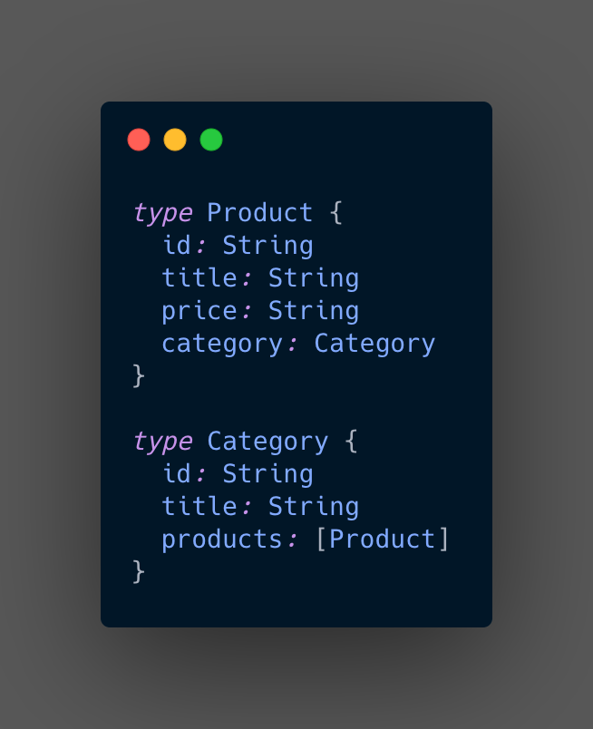
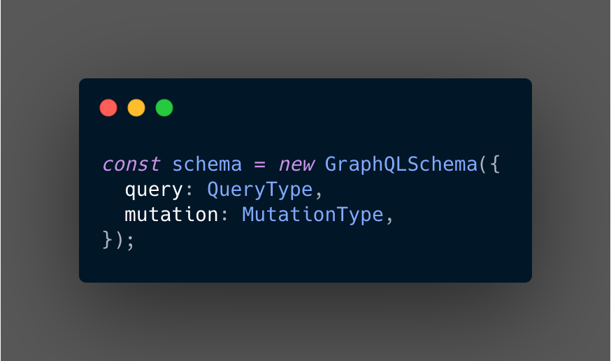
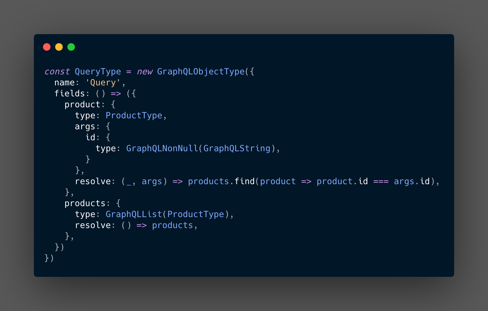
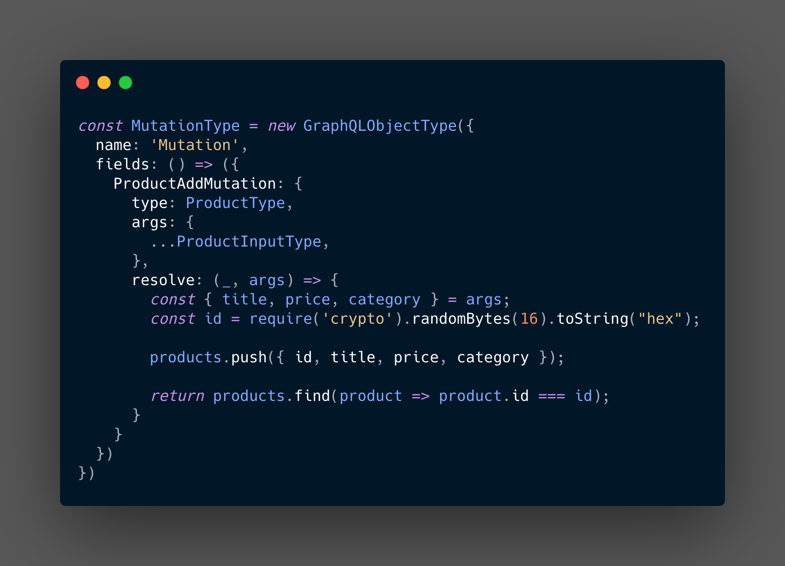
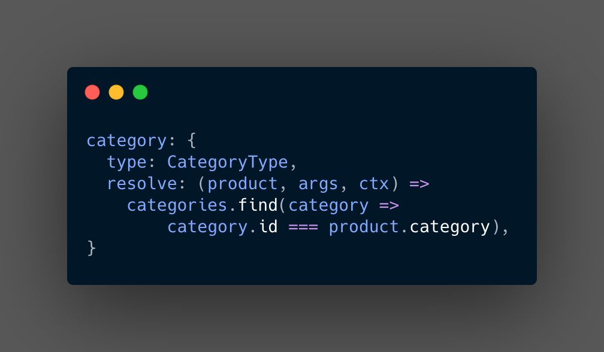
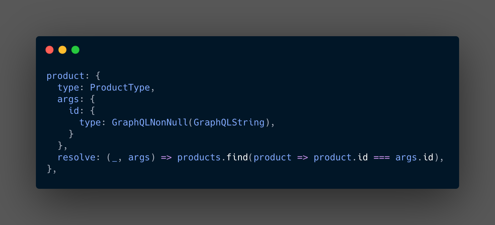
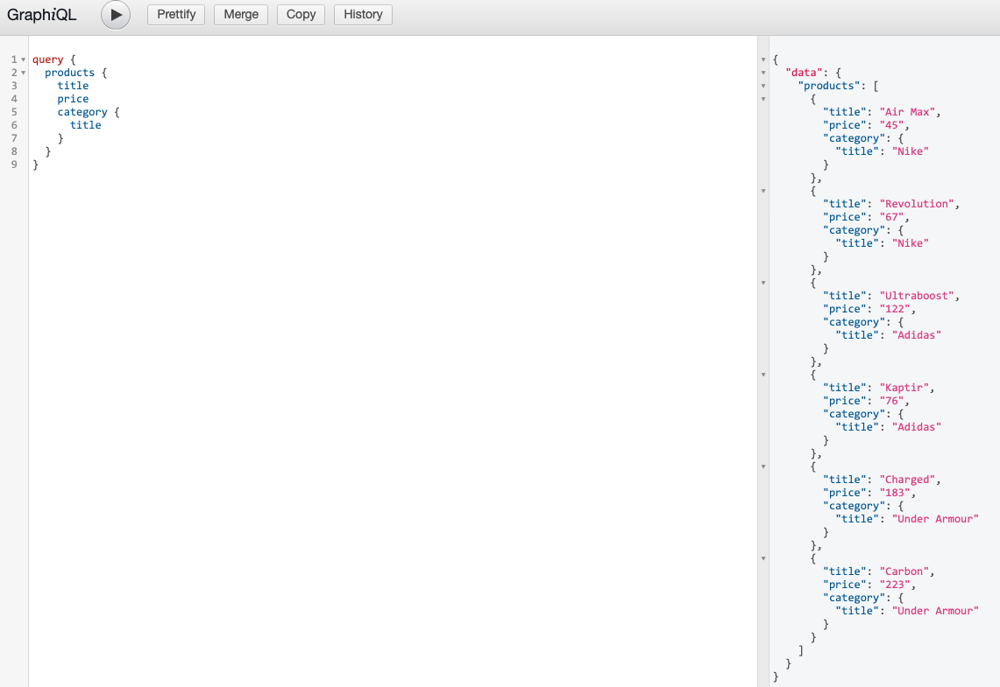

import { Head, Image, Appear } from 'mdx-deck'
import { Split, FullScreenCode } from 'mdx-deck/layouts'
import { CodeSurfer } from "mdx-deck-code-surfer";

import { Cover } from './Cover';
import { Intro } from './Intro';
import { Img } from './Img';
import { InlineImg } from './InlineImg';
import { Thanks } from './Thanks';

export { default as theme } from './theme'

<Head>
  <title>GraphQL - Primeiros Passos</title>
</Head>

<Cover />

---

<Intro />

---

# Overview

<ul>
    <Appear>
        <li>
            Single Endpoint
        </li>
        <li>
            Overfetching / Under-fetching
        </li>
        <li>
            Schema
        </li>
    </Appear>
</ul>

---

# Schema 

---

# Schema 

---

# Scalar types

<ul>
    <Appear>
        <li>
            Int
        </li>
        <li>
            Float
        </li>
        <li>
            String
        </li>
        <li>
            Boolean
        </li>
        <li>
            ID
        </li>
    </Appear>
</ul>

---

# Query X Mutation

---

# Query 

---

# Mutation 

---

# Resolvers

---

# Resolvers

---
# GraphiQL

---

## References
- [GraphQL.org](https://graphql.org/learn//)
- [How to GraphQL](https://www.howtographql.com/)

---

<Thanks />

